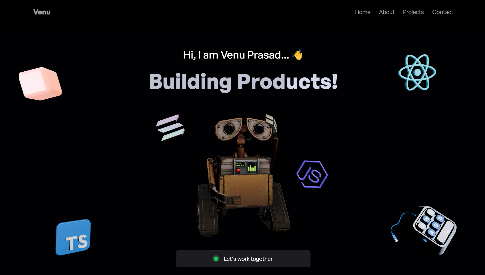

# Portfolio | [Venu/Vinsmoke]

[](https://react.dev/)
[](https://threejs.org/)
[](https://tailwindcss.com/)
[](https://vitejs.dev/)


[](https://ven-forge.vercel.app/)

A modern 3D interactive portfolio showcasing my work, built with cutting-edge web technologies.



## ✨ Features

- **3D Visual Experiences** powered by Three.js and React Three Fiber
- **Responsive Design** with Tailwind CSS
- **Modern UI/UX** with smooth animations and transitions
- **Performance Optimized** 3D rendering pipeline
- Dynamic Content Management
- Interactive 3D Models and Environments

## 🛠 Tech Stack

- **Frontend**: React + JavaScript
- **3D Library**: Three.js
- **React Integration**: @react-three/fiber & @react-three/drei 
- **Styling**: Tailwind CSS 
- **Build Tool**: Vite
- **3D Postprocessing**: @react-three/postprocessing , gsap
- **Deployment**: Vercel

## 🚀 Installation

1. Clone the repository:
```bash
git clone https://github.com/vinsmokejazz/venForge.git 
cd portfolio && npm install
npm run dev

